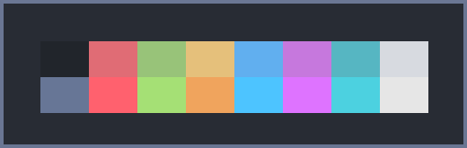
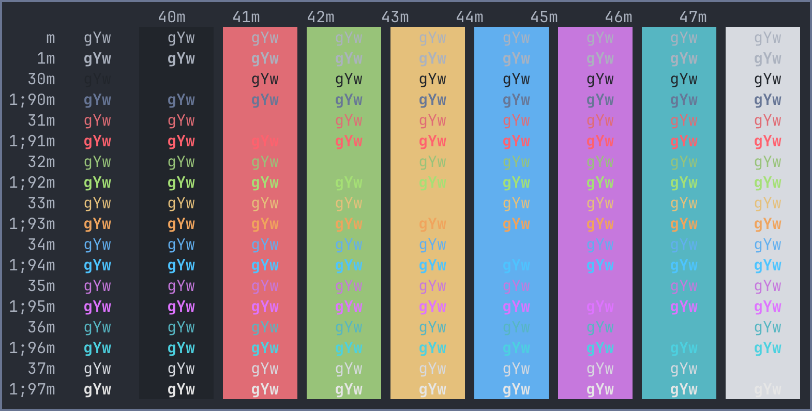

# One Dark Pro Ghostty
One Dark Pro for Ghostty.

 

* [Ghostty for macOS and Linux](https://ghostty.org/)

* [One Dark Pro for VS Code](https://github.com/Binaryify/OneDark-Pro/) 

Place file in ~/.config/ghostty/themes/ (create folders if non-existing).

*One Dark Pro*

 

